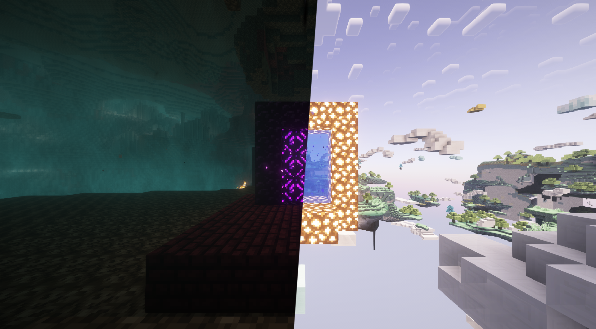
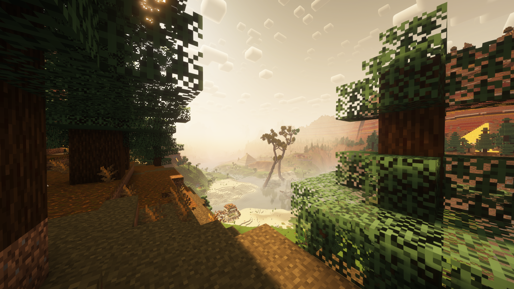
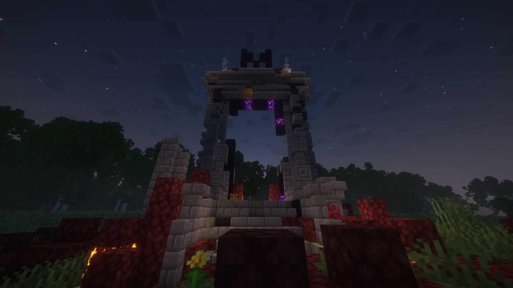
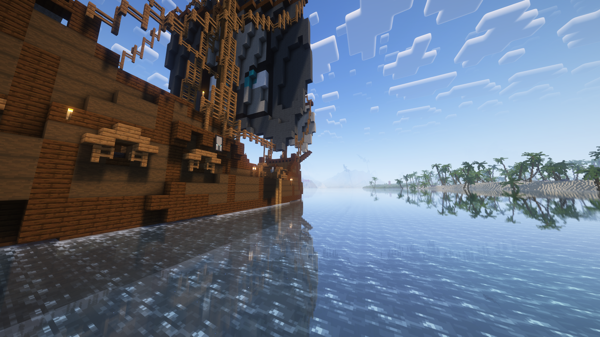
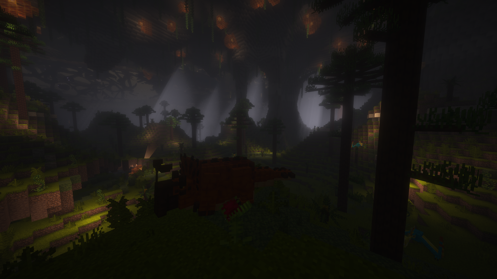
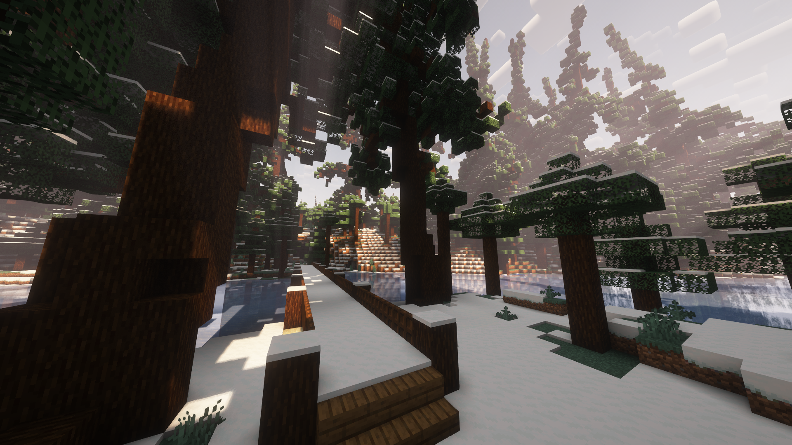
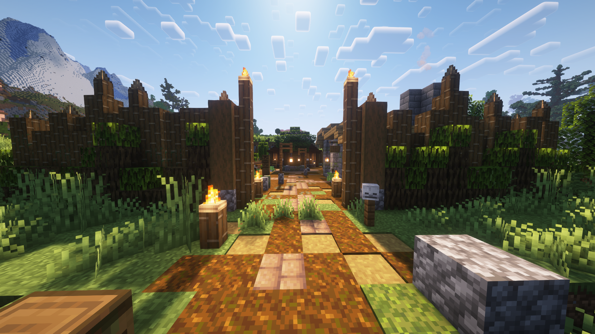

### Normas:

El uso indebido de estas normas puede llevar a la expulsión permanente del servidor

---

- Prohibido destruir construcciones ajenas sin permiso.
- Permiso explicito necesario antes de construir granjas complejas (alta cantidad de entidades).
- No spam ni máquinas de lag.
- Respetar el mundo; evitar destruir grandes partes del medio ambiente sin sentido.
- Acceso libre a todas las dimensiones. No hay que esperar ni a eventos ni a ciertas fechas.
- Pasarlo bien :)
---
  
## Información general: 
Al igual que en su precuela, el servidor estará abierto las 24 horas del dia todos los dias. Si queremos entrar y éste parece vacío, simplemente tendremos que hacer doble click como si entraramos de manera normal, y esperar a que el servidor se abra por su cuenta. Si uno de los jugadores decide dejar el servidor, una vez se comunique y/o se sepa, su impacto en el mundo podrá ser explotado por los demás participantes, sea recursos, estructuras u otros.

  1. Al igual que su hermano pequeño, el mundo de **CHARLETACRAFT 3** posee un mundo repleto de distintos biomas. Esta vez, el mapa es gigantesco. Montañas nevadas, rios perfectos para la navegación, anchas llanuras idílicas para una base o granja, desiertos, todo tipo de árboles, tanto clásicos como nuevos por generación dinámica, savanas y mesetas. Si el mapa de la versión anterior ya era de un tamaño considerable, veremos muy rápidamente que este en comparación es gigantesco. 

  2. El servidor contiene una gigantesca colección de Mods, desde nuevos vehiculos hasta nuevas dimensiones, pasando por mucho más. **Esta vez, la instalación cambia**. Usaremos una nueva herramienta para reducir el proceso y su complejidad; la aplicación [Modrinth](https://modrinth.com/app). Esta nos permitirá instalar todo el paquete de mods a la vez. Si alguno de vosotros habéis jugado al Lethal Company con mods, es muy probable que ya hagáis usado esta herramienta. Debajo hay un pequeño tutorial de como instalarlo para aquellos que lo necesiten.

  

  

## Galeria: 

